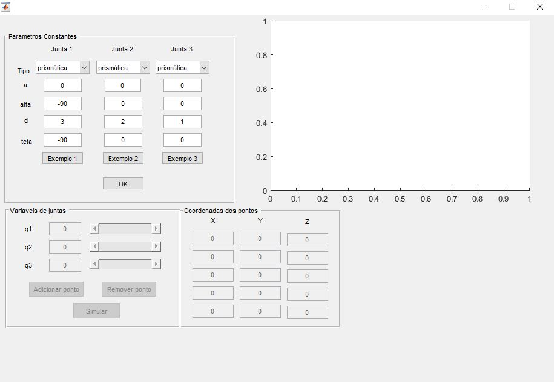

# Simulador 3D de manipuladores em MATLAB

Projeto desenvolvido no âmbito da disciplina de Fundamentos de Robótica do curso de Engenharia de Instrumentação, Automação e Robótica da Universidade Federal do ABC (UFABC), ministrada pelo prof. Dr. Sandro L. Vatanabe, junto de meus colegas Gilmar J. Correa e Ana Laura B. Claudio. 

O projeto consiste de um software desenvolvido em MATLAB em que o usuário pode compor um manipulador robótico arbitrário de três juntas  e, em seguida, escolher de 2 a 5 conjuntos de posições lineares/angulares de juntas para simular a trajetória da extremidade final do manipulador ao se deslocar sequencialmente entre as posições definidas.

## Instruções

Abrir o diretório manipulador_3D_final em MATLAB, e executar o arquivo main.m.

Uma interface gráfica será aberta, como na figura baixo, e o usuário será requisitado a definir os tipos de juntas (rotativa ou prismática) e os parâmetros do manipulador. Tais parâmetros podem ser definidos manualmente, inserindo os parâmetros de Denavit–Hartenberg (a, alfa, d, teta) do manipulador desejado, ou podem ser escolhidas dentre os três exemplos pré-definidos.

Os parâmetros de Denavit–Hartenberg para cada junta são definidos como na figura abaixo:

  

d: distância ao longo do eixo z anterior até a normal comum.

&#952;: ângulo em torno do eixo z anterior, do eixo x anterior até o eixo x atual.

a: comprimento da normal comum. 

&#945;: ângulo em torno da normal comum, do eixo z anterior ao eixo z atual.

Em seguida, pede-se ao usuário que sejam adicionados de dois a cinco pontos (de forma que cada ponto corresponde a um conjunto de posições de juntas) indicando as posições entre as quais o manipulador irá transitar durante sua movimentação. Para cada posição, pode-se modificar os parãmetros de cada junta - que correpondem ao deslocamento linear da haste ou seu deslocamento angular, a depender do tipo de junta -, observando o resultado da mudança na figura. Ao se estabelecer a posição desejada, o usuário deve clicar em "Adicionar Ponto", e então proceder da mesma forma para as posições seguintes. A opção "Remover Ponto" pode ser usada para remover o último ponto caso necessário. A partir do segundo ponto adicionado, o usuário pode clicar em "Simular" e observar a animação da movimentação do manipulador entre os pontos escolhidos bem como a linha de trajetória da sua extremidade. 
